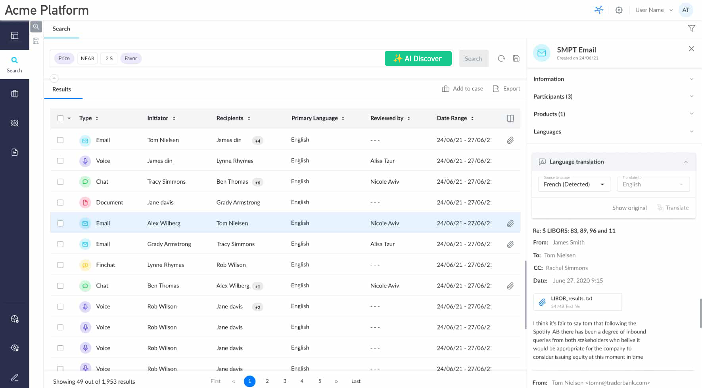
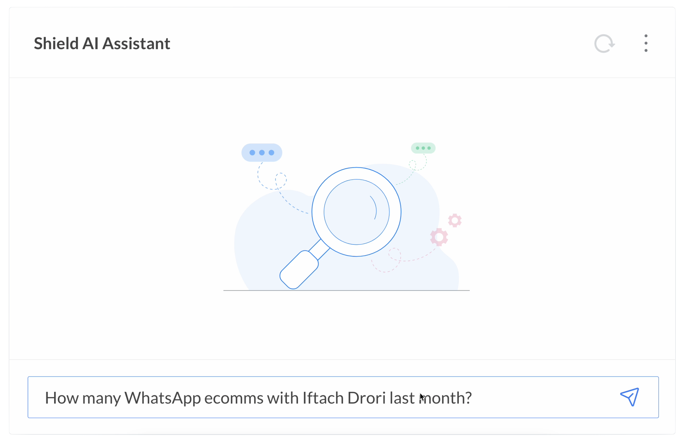
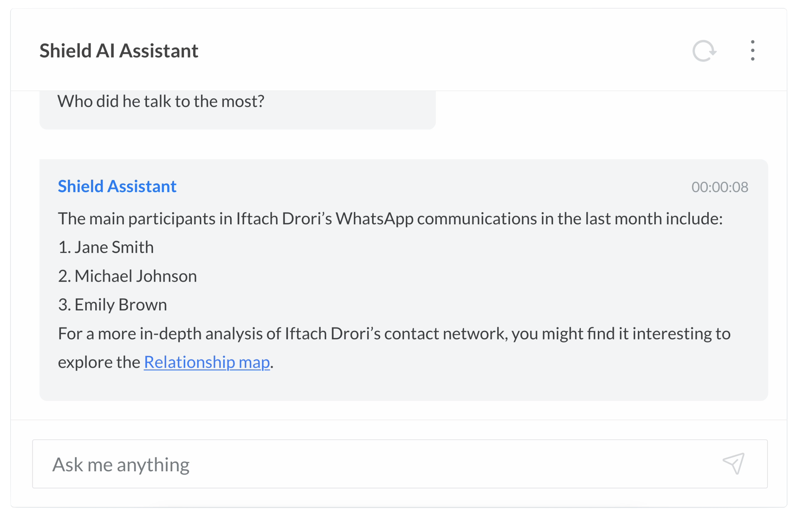
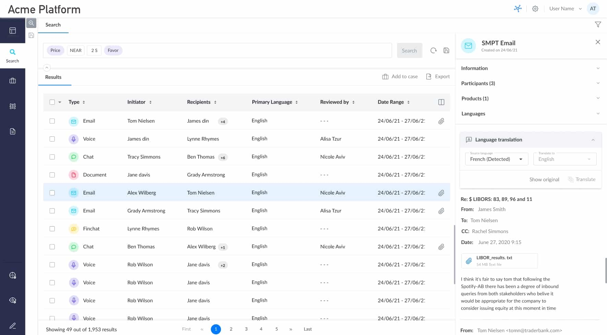

<span class="cs-page-kicker">Case Studies > Acme (2024) > Knowledge base article</span>

# Find your risk data with Acme Discover

Acme's **Discover** features a robust search capability that allows you to quickly access your risk and compliance data. Through advanced, structured search querying, you can discover, analyze, and make informed decisions about non-compliance risks in your organization. Newly upgraded with generative AI technology, Acme now offers unparalleled access to your data through natural conversation.

!!! idea "Choose a topic below to learn more about Acme Discover."


/// caption
Acme Discover platform overview
///

## ✨ Acme AI Assistant

**Acme AI Assistant** is a new assistant in the Acme platform that helps you query your data by writing in free, conversational language, as easily as you would with any assistant. It simplifies the search process, giving you quicker access to the data you need, no matter how complex your query may be.

To get started with Acme AI Assistant, follow these steps:

1. Navigate to the Home page in the Acme platform.
2. Under the **Conduct** tab, go to the new **Acme AI Assistant** module at the right of the dashboard.
3. Enter your question or request.

The assistant will respond in conversational English, occasionally offering additional steps you can take to pinpoint your search. You can provide it feedback, or refine your prompt to create even more pinpointed searches.

!!! example "The assistant works best with natural-language prompts."
    Feel free to write as naturally as you would in a conversation. For example:

    - *Show me my most critical non-compliance risks.*
    - *I want to see instances of market abuse in our org from 2020-2022.*
    - *Can you find my new high-alert hits?*

!!! info "Acme AI Assistant is only available for the **Enterprise Plan**. [Learn more.](https://link-to.pricing)"


/// caption
Ask the new Acme AI Assistant a question in natural, conversational English.
///


/// caption
The assistant provides actionable responses to help follow up on your request.
///

## Classic query-based search

!!! abstract "[Placeholder for structured search query KB]"



## Search with Acme Discover

!!! abstract "[Placeholder for search KB]"
    Searching with Acme's Discover is easy. To get started...

    ```
    /* Examples: */

    // Helps you find... 
    Price NEAR 2S 'Favor'

    // Another example
    Email CONTAINS 'acmecorporation.com'
    ```

## Frequently asked questions

#### **How would a user access the user guide?**

Users can access the guide in a variety of ways:

- **In-app**, by clicking on a widget trigger within the context of the app (e.g., next to the search bar or within the Assistant UI). The widget guides users directly to how they should interact with the Acme app's UI, while providing tips on how best to leverage this feature.
- **Web-based**, by visiting the KB's subdomain on the Acme platform (e.g., https://app.acme.com/help).
- **In-platform release notes**, which will announce the deployed feature with a summary and helpful links.

#### **What approach would you take to ensure the documentation is structured logically and easy to navigate?**

- **Short answer:** Through rigorous writing, rewriting, reviewing, and more rewriting.
- **Long answer:** We should establish a content style guide that clearly defines the Acme tone and voice and provides guidelines for content creation in the Knowledge Base.

#### **How would you validate the [guide] is searchable?**

We can ensure the guide is searchable by implementing common SEO practices and effectively applying search tags.

Furthermore, I think it would be an excellent idea to develop an AI assistant with access to the KB, and use it to determine whether it can successfully generate helpful user-facing content. If the AI is confused or hallucinates, there is a good chance that the language in the KB needs to be reviewed.

#### **How would you measure the effectiveness of the user guide?**

This can be achieved through data-driven practices. For example, we can track adoption and monitor user behavior between two test segments of beta users—those with and without access to the KB content (both in-app and web-based).

We can also monitor the guide's usage data to determine the amount of engagement. Here are some common KPIs we could look out for:

- View count, number of active sessions
- Session duration, drop-off times, bounce rate
- User flow and drop-off steps (i.e., how far into the guide users go)
- Obsolescence (i.e., content age vs. traffic)
- Common search terms, search success rate (i.e., whether users who search for the topic successfully land on the guide)
