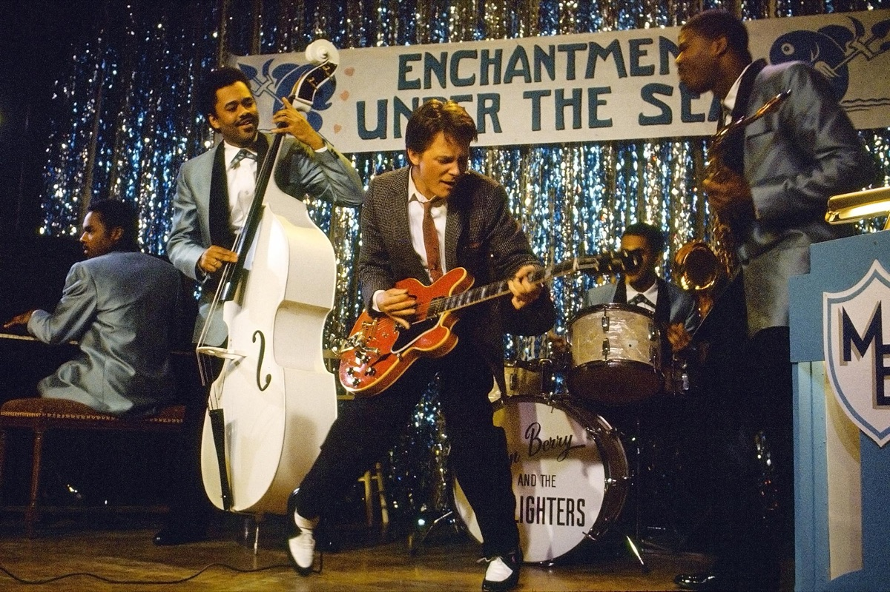
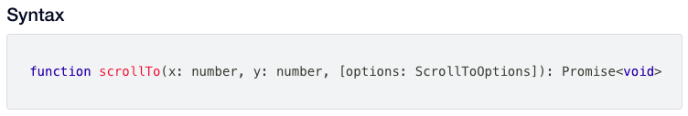
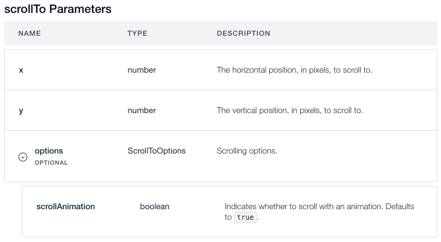

<span class="cs-page-kicker">Case Studies > Website API (2021)</span>

# What is an API?

*A technical writing sample, April 2021 — an explainer aimed at developers just starting to work with a website-builder platform's client-side API.*

All programmers will need to work with an API at one point or another in their careers. Depending on how you look at it, an API—short for **Application Programming Interface**—is a very powerful tool, or set of tools, that allow a programmer to interact with an existing, standardized set of instructions. These instructions—many times in a completely different part of the world—may then be utilized to execute functions in ways unique to the programmer's application.

APIs can mean many things to many different people and organizations. However, we can try to understand APIs and how they work in a more general sense through examples from popular culture. Take, for instance, [this classic scene](https://youtu.be/S1i5coU-0_Q?t=16) from the popular film *Back to the Future*. As you watch, pay particular attention to how Marty McFly addresses the members of the band behind him before breaking into song.


/// caption
Marty McFly playing "Johnny B. Goode" with Marvin Berry and the Starlighters
///

## Alright, guys. Listen...

After introducing the next song to the audience, Marty turns around to face the band, asking for their attention: "Alright, guys. Listen." He then makes a brief declaration of the song structure, which to a non-musician would only sound like a coded message: "This is a blues riff in B, watch me for the changes, and try and keep up, okay?" Without waiting for as much as a confirmation, Marty turns to face the audience again, plays the first two measures of Chuck Berry's "Johnny B. Goode," and as if by magic, the band enters on cue and on key without missing a beat.

Now let's deconstruct this scene as an analogy for how APIs work.

Consider first that in this moment, Marty McFly is a programmer, and that the application he would like to build is a song. Marty has a set of tools that he knows how to use—his guitar and knowledge of the basic elements of popular music. In particular, his musical knowledge is accompanied by a common language shared by other musicians, which allows him to interface directly with them.

As Marty turns around to face Marvin Berry and the Starlighters, he is actually making a request to connect. He asks the band to listen, similarly to how a programmer provides a key to access an API, or to link to a library. The other musicians on stage can be considered as server-side programs with whom Marty can interface. As musical accompanists, they are also programmed to understand the language around music, and it is their collective job as a band to be able to translate the client's requests into actions.

Now let's take a look at Marty's request for a "blues riff in B." While terse and seemingly cryptic, this is actually just a query for a complex set of instructions. From these words, the band understands exactly what parameters Marty is referring to, as well as the values of each of these parameters.

| Parameter | Value |
| --- | --- |
| Key | B major |
| Time Signature | 4/4 |
| Tempo | Allegro (about 168 BPM) |
| Chord Library | B, E, F# |
| Progression | 12-bar blues (4 measures of B, 2 measures of E, 2 measures of B, 1 measure of F#, 1 measure of E, 2 measures of B) |
| Structure | Introduction, Verse, Chorus, Verse, Chorus, Solo, Verse, Chorus |

*Table 1: Parameters and their values of a 12-bar blues song in B*

Now, if the band as a whole can be considered the API with which Marty the programmer interfaces, then each individual musician further represents an internal program. These internal programs contain their own functions, and are also capable of making calls to other APIs. Each member may contain different programs, but they are written in the same language.

For example, the bass player will recall blues bass lines from his musical experience, thus enabling him to lead the rest of the band through the chord changes. The drummer knows to indicate the down-beats of every measure on the bass drum, and mark the up-beats on the snare drum, all while maintaining the tempo and adding swing rhythms on the cymbals. The pianist playfully enhances the tonal richness of the composition by playing variations on the vocal and guitar lines. And the saxophone provides dramatic bursts at the beginning of each measure, as if to declare: *Yes, we are still in the key of B. And yes, it is awesome!*

## Watch me for the changes...

For the sake of completing the analogy, let's quickly analyze the remainder of Marty's query to the band API. After initially decoding the musical structure, the band is then instructed to "watch me for the changes, and try and keep up." This is where the **interface** part of API comes in. Essentially, Marty's request is for the server side (the band) to maintain a connection, and to "listen" in order to intercept any events or interaction from the client side (Marty's guitar).

All in all, an API is really just a way for an application on one machine to speak to an application on another machine. It also enables the client-side application to produce an expected behavior without the programmer having to write all of the server-side instructions themselves. Whether an app integrates a map element on its UI, or a user taps on an icon on their smartphone to enter a social app, today the use of APIs is as ubiquitous as human interaction itself.

## Try and keep up, okay?

So what does this all mean with reference to a real, working API? Well, in order for you to be able to utilize the powerful functionality of an API, you want to know how to interact with it. Marty McFly knew how to interact with other musicians because they all shared a common language. This means that you as a programmer should be able to understand what an API expects to hear, in order to understand how to speak with it.

### Definition and Description

Let's assume a more concrete example: that you would like to implement a `scrollTo()` function from a website-builder platform's client-side window API into your application. When consulting the API documentation for a particular function, the first thing that you should notice is the name of the function in the heading, as well as a brief **definition** of the function and how it behaves (see *Figure 2* below).

Further details about the function's expected behavior is provided in the **Description**. Some descriptions in this kind of API documentation also provide a **tip** for where to find certain information or data which helps you better utilize the function. In this example, the `scrollTo()` function, when called on a web page, makes the web page "jump" to a specific location or position, denoted by **x** and **y** coordinates.

This type of functionality is particularly useful on web pages that include a lot of text. It can be implemented in a Table of Contents at the top of a page, which includes many sections. This function therefore provides the user with a useful way to browse directly to information without having to do it manually or search through the page on their own.

Note that documentation like this frequently uses this function itself: the table at the top of the page contains names of functions, each with an embedded hyperlink. Clicking the hyperlink will automatically scroll down in the browser window to a location in the same page where the user can read more information about the function.

### Syntax and Parameters

Once you have understood the purpose of the function, the next thing you should notice is the function's **syntax**. The syntax is a basic explanation of the textual format that is necessary for the function to understand what to do and what parameters to use. In documentation like this, it's usually presented in the form of a code block, as can be seen below.



In order to correctly call the `scrollTo()` function, you must provide both required parameters—x and y, both of which are numbers set apart by a comma (,). This function also allows you to provide optional parameters, indicated by the text within square brackets (`[options: ScrollToOptions]`). For your reference, further details about each of these parameters is outlined in the **Parameters** section, found directly below the **Syntax** section (see below).

The **Parameters** section contains a table outlining the names of the function's parameters, their data type, and a description that clarifies their meaning, usage, and default values. In addition, you can click the down-arrow icon to the left of the **options** entry in order to expand the table and view the optional parameters.



In this case, we see that the only optional parameter for the `scrollTo()` function is denoted by `scrollAnimation`, which is of boolean type. This means that including the `scrollAnimation` parameter should be followed by specifying its value as either **true** or **false**. When defined as **true**, this parameter tells the function to physically scroll through the page to the specified location. Otherwise, a value of **false** means the page automatically jumps to the indicated coordinates without any animation.

### Code Example

Finally, many of the functions described in this kind of API documentation include snippets of example code. These snippets provide you with a more concrete example for understanding how to implement these functions in your own code. At the top right of each code example, you will also find a **Copy Code** button, which is simply a shortcut that allows you to copy the entire code example to your clipboard. You will then be able to paste it directly into your code as you see fit.

```javascript
import platformWindow from 'platform-window';

// Scroll the page to a location and log a message when done
platformWindow.scrollTo(100, 500)
  .then(() => {
    console.log("Done with scroll");
  });
```

## Further Reading

To learn more about `scrollTo()`, as well as other relevant functions, consult your platform's own client-side API reference documentation.
