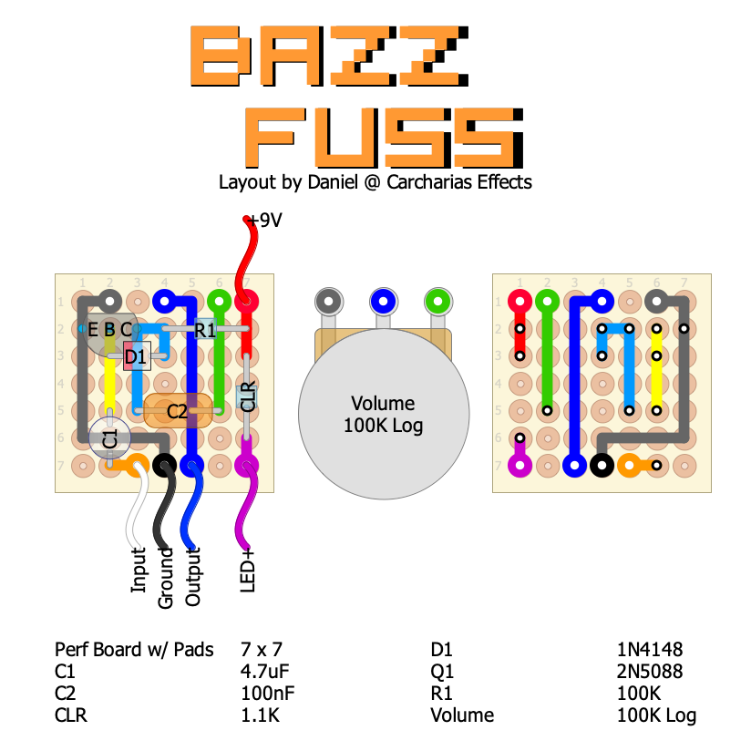
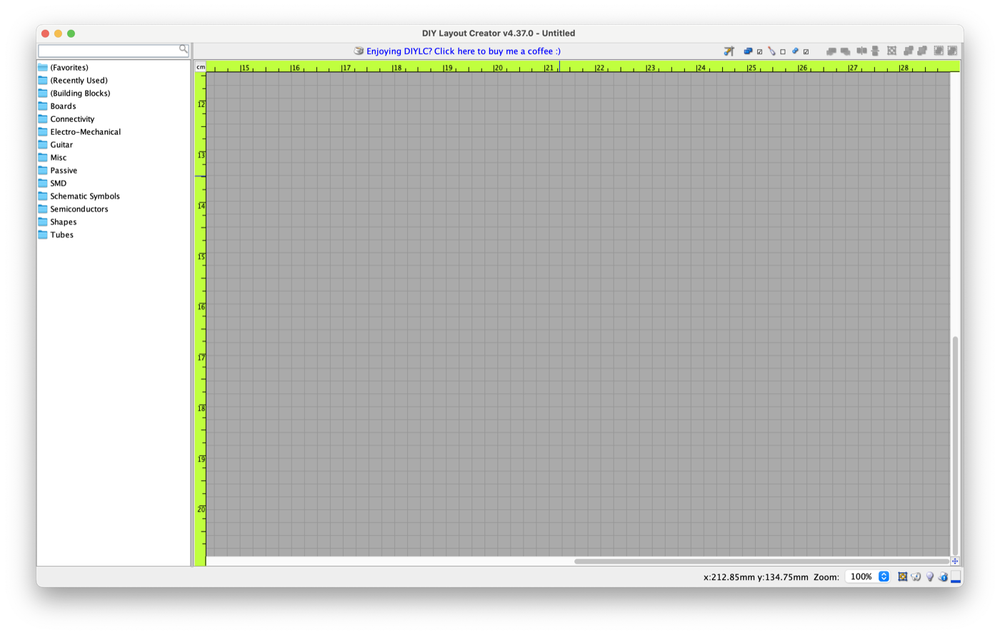

# Designing your own DIY PCBs for prototyping pedals

I've been asked several times if I could share how I make custom layouts, i.e., what is my approach to breadboarding and then laying out a circuit on vero or perf board. Like a lot of DIY pedal builders, I like to use the software [DIY Layout Creator](http://diy-fever.com/software/diylc/)—it is a great tool for those of us small-timers working on a pretty minimal budget. It is free, open-source, multi-platform, and I also like to participate in the development process, i.e., submitting bug reports, and also feature requests. It's pretty cool when you get to see a feature that you've requested get implemented and rolled out, especially when it facilitates your workflow.

Anyway, in this blog post, I would like to outline my process, motivations, and strategies in creating layouts. I'll use the example of the Bazz Fuss--an ultra-simple circuit originally designed by Christian Hemmo (you can read up about it [here](http://home-wrecker.com/bazz.html)). This circuit only has **six** components, so it is perfect for breadboarding and modding, and I've done many layouts of it already, so it will be a great place to start. I've included some images to assist in the process.

Are you ready?

## Leave room for capacitors

Save enough room for **capacitors**, particularly the green polyester caps and the radial electrolytic capacitors. I'd put a 1-space buffer between these caps and any other component. Measure the components you are working with. I've got a digital calipher at home, and it has been incredibly useful.

<!-- SHIELD-IMAGE: caption="Note that some of those green mylar film capacitors are pretty big." step=2680192 imageId=897d1556-3ed8-42b9-8cf8-eeb9193a9a14 -->

## Pad placement

Now you should be ready to start building your layout. First thing's first, understand where your **input**, **ground**, and **output (IGO)** pads should be positioned, and place them on the side of the board that is closest to your on/off (e.g., 3PDT) switch. For my builds, I typically place them at the bottom of the board and in the indicated order from left to right. Accordingly, the 9V pad typically gets placed at the top of the board, but it's basically as close as possible to where I'm planning to drill the 9V jack. Some people like to place the 9V jack on the side of the enclosure. I prefer the top. Different strokes.

If I'm doing this on vero, and I'm looking at the strips horizontally, then the IGO pads will be on the left side of the board, and 9V on the right; then I put the finished circuit in the enclosure 90 degrees counterclockwise so that IGO are at the bottom (making them closer to the switch and jacks) and the 9V up top again (making it closer to the 9V jack). This obviously depends on the wiring layout I've chosen. The point is, do a little bit of planning and make sure that the board you are laying out fits the type of enclosure you want to use and the type of wiring that you want to do.

<!-- SHIELD-IMAGE: caption="The perf board with wire pads laid out" step=2680193 imageId=64f0719b-a8f8-4c49-afc1-a1a5493c146b -->

## Potentiometers: off-board or on-board?

Because I always prefer minimal off-board wiring, I like to connect my pots directly to the board. I do this either with standing pots, or by reusing old capacitor/diode/resistor leads as connectors between pot lugs and the board. This is useful for two stages of testing my build: (1) I first solder the leads to the board **before** soldering the pot lugs to the leads. I do this to to first test the entire circuit and make changes as necessary. (2) Once the circuit has been verified working, **now** you can solder the pots to their connectors.

<!-- SHIELD-IMAGE: caption="Pots are soldered directly onto the board in this layout." step=2680194 imageId=75d74289-909e-4077-8507-734d08586f9c -->

## Create a new project in DIYLC

Next, open DIYLC on your computer, but before starting to layout a clean perf or vero board, take some time to do a few preparations. The first thing you should do is create a new project and then start **creating all of the components** you will need, and start naming them according to my schematic. This keeps components in your layout coordinated by **number** and **value** with the components in the schematic which I've downloaded.

<!-- SHIELD-IMAGE: caption="" step=2680196 imageId=b9c23bb8-6c9a-40d3-bb35-608f5e714437 -->

## Breadboard your schematic

Start by choosing a schematic and breadboarding it. If you like how it sounds, go ahead and build it. Why waste the extra hours and materials soldering something that you're just not in love with? That said, take what you hear on the breadboard with a grain of salt, because breadboard builds are typically noisier than a relatively cleaner build on a PCB—the traces are shorter which drastically reduces the chances for noise interference.

<!-- SHIELD-IMAGE: caption="Original Bazz Fuss circuit found on the Homewrecker site" step=2680197 imageId=211c174b-fd94-42dd-b0be-9112ccc89f0e -->

<!-- SHIELD-IMAGE: caption="Bazz Fuss circuit post-breadboarding, with notes" step=2680197 imageId=31c3ab60-f5a0-4d41-92c9-cb4e6a9d0b6d -->

## Component placement

Take a look at the **schematic** again, and plan out the placement of your major components (transistors, IC's, etc.) accordingly. Also plan out where you want your external controls—i.e., potentiometers—in order to **keep offboard wiring to an absolute minimum**. This honestly might be a matter of personal preference, but in my experience this has also reduced the chance for noise—particularly on high-gain overdrives and fuzzes (like the Super-Fuzz, in my experience), where long cables tend to act as antennae and might create high-pitched squealing. Beyond that, aesthetically and practically speaking, there's nothing quite as satisfying as plunking your ready-made circuit into the enclosure without any of that annoying spaghetti wiring mucking up your build and making the inside of your enclosure look messy.

After adding the pads, I started planning out where my major components were going to be. Note that the pot will be soldered with its back to the solder-side of the perf board, shaft facing away. Also note that C2 has a one-row buffer so as not to crowd the components too closely together.

<!-- SHIELD-IMAGE: caption="Adding larger and more critical components to the layout" step=2680198 imageId=06bd1caa-d7e4-4372-bfcf-4f43bfc0e7fd -->

## Populate the layout

Now you can start populating your layout by copying and pasting from your schematic. This keeps the component numbering consistent to the schematic. Copy and paste the colored traces as well, so that you can keep track of your progress more easily.

## Noise filtering and voltage protection

Noise-filtering caps and voltage-protecting diodes (not shown in the Bazz Fuss). It's good to include these, especially if the schematics call for them. They should both ideally be placed as close as possible to where your 9V pad is.

## Resistors: standing or laying?

I'm okay with them. Others do not like them for aesthetic reasons. But I prefer saving space, especially if that means the circuit will fit in a smaller enclosure. The smaller the enclosure, the better, IMO.

<!-- SHIELD-IMAGE: caption="Note the standing resistors on this layout." step=2680201 imageId=a28f7171-bbcf-450f-8b73-43c653883e03 -->

## Create the solder-side layout

When you've finished your layout, copy and paste only the board and traces (you can do this by **locking** all the other components and text from the **Layers** menu in DIYLC), and then create small dots to mark where your components will be soldered on the underside of the perf board. Then flip this copy horizontally. This will be your corresponding underside (solder-side) of the perf board, which will help you as you are populating your build in the real world.

<!-- SHIELD-IMAGE: caption="The finished layout with solder-side mirrored on the right." step=2680202 imageId=f30d27ce-fe8b-4bb5-9b0b-7f4cb261e7c0 -->

## That's it!

Well, that's all I can think of for now. If you've got any tips or strategies that you use, feel free to post them in the comments below.

Happy building!

!!! tip
    💡 If you're interested in getting a production-ready version of the Bazz Fuss PCB, you can get one [here](/product/bazz-fuss-v2-pcb-diy).

## Recreate the schematic in DIYLC

Next, open DIYLC on your computer, but before starting to layout a clean perf or vero board, take some time to do a few preparations. The first thing you should do is create a new project, and start **add all of the components** you will need.

!!! tip
    💡 This is a good time to fill in the **names** and **values** of the components corresponding to the schematic. This ensures your layout will be coordinated with the original schematic, making it easier to debug.

Once you've added all your components to the new DIYLC layout, **recreate the original schematic** in DIYLC. This is an important step because it allows you to **color-code** all the different traces in the schematic, which helps debugging once the layout is finished. It may seem like an unnecessary step, but if you are an extremely visual learner like I am, then it really helps to have both the schematic and your PCB layout coordinated by color. Double-check that the original schematic and your new schematic are 1:1 before moving on.

<!-- SHIELD-IMAGE: caption="Bazz Fuss schematic after I've drawn it up in DIYLC" step=2680204 imageId=dea37ff4-d1f0-4086-a400-50fce6866839 -->

## Plan hardware integration

Next, **measure** the dimensions of your enclosure ahead of time, and make sure that your board will fit. Making the board as small as possible is partly an aesthetic motivation and partly practical—it will save you a headache if you make your board too big to fit the enclosure.

You should then plan the placement of enclosure hardware relative to where your board will be. You will mainly want to know where your 9V jack and your on/off switch will be, but if you're planning on building something with a small footprint (e.g., anything in a 1590A, 1590B, or 125B enclosure), it helps to consider the board size relative to where the input and output jacks will be as well—as in builds that include top-mounted or side-mounted jacks.

