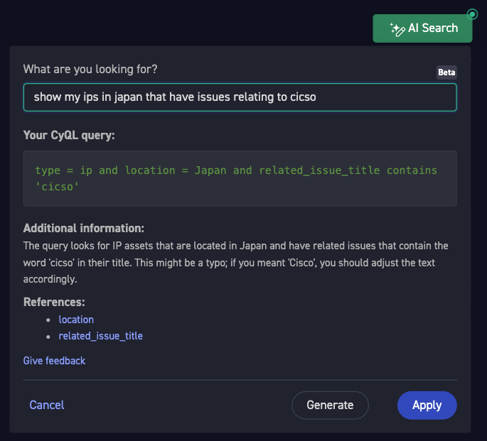
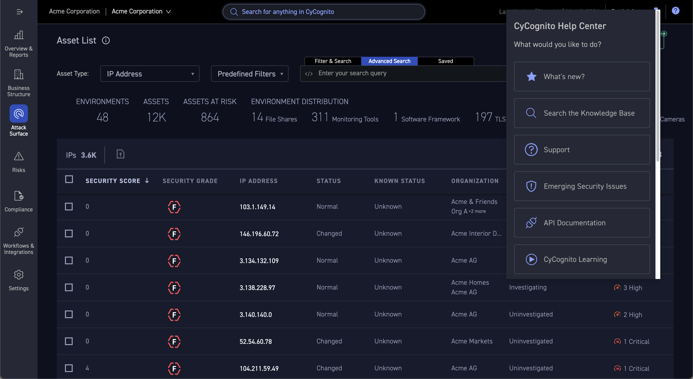

What I do

# Feature Development

Interdepartmental collaborations delivering exciting new features:

- **AI-powered knowledge search:** Building and maintaining a RAG-based agent that provides answers directly from the knowledge base; automation script design for processing JSON exported from third-party platforms into machine-readable documentation; prompt definition; usage analysis
- **AI search:** Translation agent that converts user-entered natural language prompts into proprietary querying language syntax; prompt engineering; KB optimization; usage data analysis and model improvement
- **Internal knowledge bot:** Internal Slackbot that accesses knowledge silos across an entire organization and provides a unified answer to any employee about any internal knowledge
- **Help menu:** In-app help menu project with the Support team, fully integrated with a Zendesk-based platform. 3-month KPIs included:
    - Reduced email-based ticket submissions from 30% to 19%
    - Increased customer engagement (+11% total guide views)
    - More frequent user interaction with help resources (+8% active sessions)

/// caption
An AI search assistant translating a natural-language question into a structured query, with an explanation of the query logic
///

/// caption
A contextual help-center menu offering What's New, Search the Knowledge Base, Support, and other options
///

