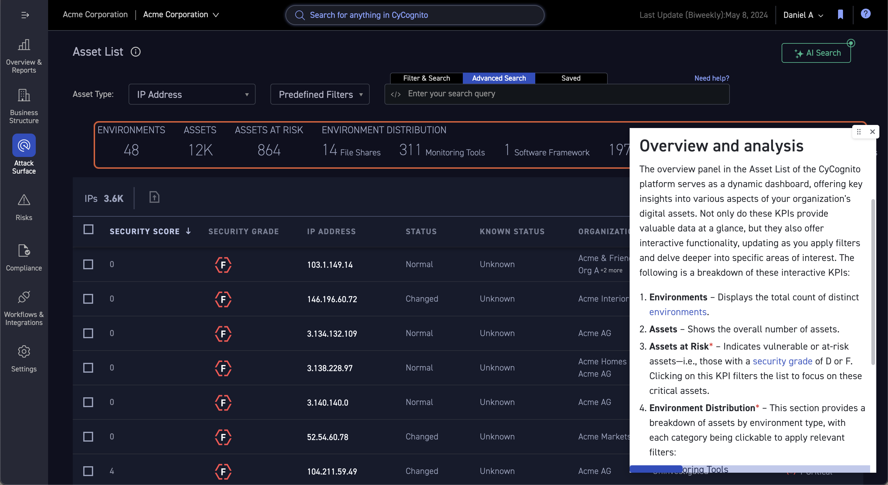

What I do

# Knowledge Architecture

I create and manage the knowledge base infrastructure, tailoring it to match the needs and complexity of your product.

- Identifying and organizing content corresponding to logical product areas
- Helping users find the information they need by ensuring searchability
- Providing assistance when and where it is needed most by integrating knowledge features with your platform
- Optimizing content for multiple formats—web, guides, announcements, banners, etc.

/// caption
A knowledge base homepage with a search bar and category tiles for Getting Started, Product Areas, and Updates and Releases
///

/// caption
Knowledge integrated in-app: an overview panel with interactive KPIs, explained in a contextual help tooltip
///

